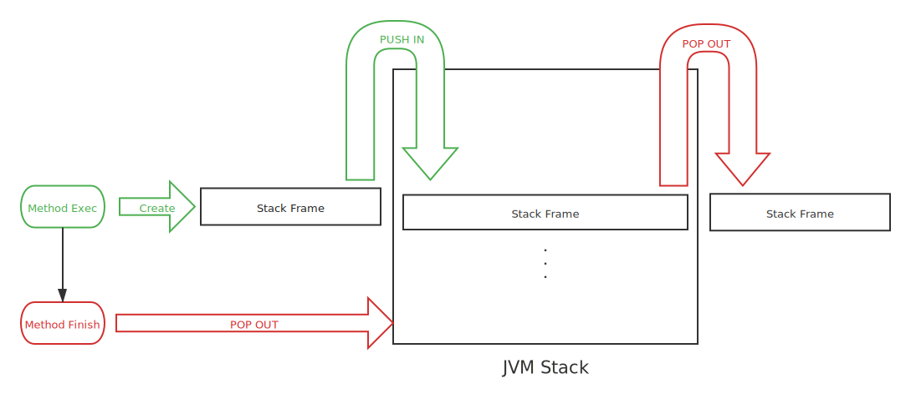

# 1.1 运行时数据区域

> Java虚拟机在执行Java程序的过程中会把内存划分为多个不同的区域，这些区域功用各不相同，且创建和销毁的机制也不尽相同。有的区域随着虚拟机的启动而一直存在，而有的区域则是会随着用户线程的启动与结束而创建和销毁。

## 1.1.1 Java VM 的运行时内存区域划分

JVM 的`运行时`内存区域大致有以下：

* [程序计数器](#1-程序计数器-pc-线程私有)

* [Java虚拟机栈](#2-java虚拟机栈-线程私有)

* [本地方法栈](#3-本地方法栈)

* [Java堆](#4-Java堆)

* [方法区](#5-方法区)
  * [运行时常量池](#6-运行时常量池)

* [直接内存](#7-直接内存)

### 1. 程序计数器 PC （线程私有）

   ``程序计数器``（Program Counter Register）, 是一块较小的、用于``指示``当前线程所执行``指令``的``行号``的内存空间。其功能和硬件中的程序计数器PC基本一致。

   在Java虚拟机的``概念模型``中，<ins>``字节码解释器``工作时就是通过``改变``PC的``值``来``选取``下一条所需执行的字节码``指令``。</ins>

   程序计数器PC是``程序控制流``的``指示器``, ``分支``、``循环``、``跳转``、``异常处理``和``线程恢复``等等基础功能都需要依赖PC来完成。

   由于<ins>JVM中的多线程是通过线程间轮流切换分配CPU资源的方式来实现</ins>的，即在任意确定时刻，一个CPU单元都只会执行一条线程中的指令。故而，<ins>为了保证线程切换后能恢复到正确的执行位置，``每条线程``都需要有一个``独立``的``程序计数器（PC）``。</ins> 每条线程的PC互不影响，独立存储，这类内存区域可称为“``线程私有内存``”。

   > 注： 
   >
   > * 在JVM中，如果当前线程所执行的字节码指令是一个**Java方法**，PC中存储的值是这个**字节码指令的地址**，若当前线程所执行的是一个**本地（Native）方法**的话，则PC中存储的值应该是**空（undefined）**。
   >
   > * **程序计数器（PC）区域是JVM中唯一没有规定OutOfMemoryError的区域！**

### 2. Java虚拟机栈 （线程私有）

   ``Java虚拟机栈`` (Java VM Stack) , 是JVM中用于存放 **Java方法**``栈帧``（Stack Frame）的内存区域。

​	Java虚拟机栈只服务于``Java方法``。

​	Java虚拟机栈也是``线程私有``的，其生命周期与线程一致。

​	``栈帧``（Stack Frame），是当线程中方法执行时JVM同步创建的一个数据结构，其用于存储：``局部变量表``、``操作数栈``、``动态连接``和``方法出口``等信息。

>* **栈帧**：
>   * 局部变量表
>   * 操作数栈
>   * 动态连接
>   * 方法出口

​	每一个``方法``从``调用``到``执行完毕``的过程，都对应着一个``栈帧``从Java虚拟机栈中``入栈``到``出栈``的过程。	

<b>图: 方法执行过程与JVM栈</b>

​	**局部变量表**，很多时候人们说的所谓JVM“栈”其实是在说JVM栈中的``局部变量表``部分。局部变量表中存放了所有**编译期**可知的``基本数据类型``（byte、boolean、char、short、int、float、long、double）、``对象引用类型``（reference类型，并不等同于对象本身，只是一个指向对象区域首地址的指针或者对象的句柄。）和``returnAddress类型``（指向一条字节码指令的地址）。

> * **局部变量表**：
>   * 基本数据类型（byte、boolean、char、short、int、float、long、double）
>   * 对象引用类型（对象指针、句柄）
>   * returnAddress类型（指令地址）

​	这些数据类型在局部变量表中以``局部变量槽``（Slot）来表示，其中``64位``长度的``long``和``double``类型会占据``2``个Slot，其他类型均占据一个Slot。

​	``局部变量表``所需要的``内存空间``在``编译``期间即完成分配。<ins>当``进入``一个``方法``时，这个方法所需要在帧栈（Stack Frame）中为局部变量表分配的``空间``是``完全确定``的，在方法运行期间不会改变局部变量表的**大小**（即Slot数量不变）。</ins>

### 3. 本地方法栈 （线程私有）

   本地方法栈的``功能``与Java方法栈``类似``只是使用范围不一样。

​	Java虚拟机方法栈服务于Java方法，而相应的，``本地方法栈``则服务于``本地（Native）方法``。

### 4. Java堆 （公有）

   

### 5. 方法区

   

### 6. 运行时常量池

   

### 7. 直接内存

   

